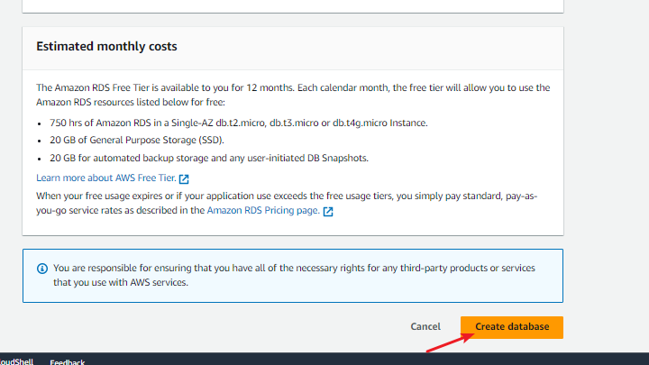

# Digiboost_Wordpress_project
# WordPress-Site-on-Aws-for-DigitalBoost
A small to a medium-sized digital marketing agency, "DigitalBoost", wants to enhance its online presence by creating a high-performance WordPress-based website for their clients. The agency needs a scalable, secure, and cost-effective solution that can handle increasing traffic and seamlessly integrate with their existing infrastructure.

## Task
As an AWS Solutions Architect, my task is to design and implement a WordPress solution using various AWS services, such as Networking, Compute, Object Storage, and Databases.

### PURPOSE:
Reduced Cost, increase Security and Scalability are the major requirements for this project. Hence, implementing the architecture designed below, ensure that infrastructure for both websites (WordPress and Tooling) are resilient to Web Server failures, can accomodate increased traffic and at the same time, has reasonable cost.

### AWS resources Required for the Design:
North Virginia Region (us-east-1)
Availibility zones (3 subnets in us-east-1a) and (3 subnets in us-east-1b)
VPC Network Range - 12.0.0.0/16
subnets - 12.0.1.0/24, 12.0.2.0/24, 12.0.3.0/24, 12.0.4.0/24, 12.0.5.0/24 and 12.0.6.0/24
6 subnets (4 private subnets and 2 public subnets)
Internet gateway for access to the Bastion Host
A Bastion hosts/jump server
An Application Load balancers(ALB)
Auto scaling Groups to manage the scaling of the Ec2 instances
NAT gateways for the resources in the private subnet to communicate with the internet gateway.
N/B: The NAT gateway only allows traffic to the internet and does not allow from the internet.
2 Route Tables (Public and private for the subnets)
Route DNS
RDS for the database
Amazon Elastic Files System for the file management 

### 1. SET UP VPC AND ITS SUBNETS
Step 1: Define Address Range for the VPC
Determine the CIDR block for the VPC which is  12.0.0.0/16
Step 2: Create VPC with Public and Private Subnets
Two public subnets created in 2 availability zones and four private subnets created for the 2 availability zones. 
This means 1 public with 2 private subnets in each availability zone.

SUBNETS: Create subnets as shown in the architecture - 3 subnets in each Availability zones i.e 12.0.1.0/24, 12.0.3.0/24, 12.0.4.0/24 in us-east-1a , then 12.0.2.0/24,
 12.0.5.0/24 and 12.0.6.0/24 in us-east-1b
 

### Step 2: Create an Internet-gateway (IGW) for the public route table and a NAT-gateway for the private route table and attach to the VPC
Internet-gateway

NAT-gateway

### Step 3 : Create Route tables, one for public subnets and one for private subnets. Associate the Route Table with public subnets and associate the main route table with the private subnets

Edit routes in the public route table for access to the Internet-gateway and the private rout table for access to the NAT-gateway.

# Summary
VPC: Digiboost-VPC : 12.0.0.0/16

Subnets:

Public Subnets: 12.0.1.0/24, 12.0.2.0/24
Private Subnets: 12.0.3.0/24, 12.0.4.0/24, 12.0.5.0/24, 12.0.6.0/24
Route Tables:

Public Route Table with route to Internet Gateway
Private Route Table with route to NAT Gateway
Internet Gateway: My-Internet-Gateway attached to the VPC

NAT Gateway: Created in the Public Subnet with an associated Elastic IP

## Create a Security Groups
Configure Security Group:

Create a new security group or select an existing one.
Add rules to allow necessary traffic (e.g., SSH for Linux or RDP for Windows).
Example for SSH access:

### Type: SSH

Protocol: TCP

Port Range: 22

Source: 0.0.0.0/0 (For public access, restrict IP range for security)

### Type: HTTP

Protocol: TCP

Port Range: 80

Source: `0.0.0.0/0

### Type: HTTPS

Protocol: TCP

Port Range: 443

Source: `0.0.0.0/0

### Type: MYSQL/Aurora for RDS

Protocol: TCP

Port Range: 3306

Source: `0.0.0.0/0

### Type: NFS for EFS

Protocol: TCP

Port Range: 2049

Source: `0.0.0.0/0

Application Load Balancer Security Group

Database Security Group

EFS Security Group

Bastion Security Group

Purchase a domain name and Create an ACM certificate!

### Create an EFS File System

Navigate to EFS Dashboard on Aws:

Create a New File System:

Click on "Create file system".
Name the file system (e.g., wordpress-efs).
Configure File System Settings:

VPC: Choose the VPC where your WordPress instances are running.
Availability and Durability: Select "Regional" for multi-AZ access.
Performance mode: Choose "General Purpose".
Throughput mode: Choose "Bursting" for typical use cases.
Encryption: Enable encryption if required.
Configure Access Points:

Click "Next".
Click "Add access point" if you need specific access point configurations, or proceed with the default settings.

Review and Create:

Review all the settings.

Click "Create".

Access point for EFS

# Step-by-Step Guide to Deploy a Managed MySQL Database Using Amazon RDS for WordPress Data Storage
## Create an instance
### Step 1: Navigate to the EC2 Dashboard
Access EC2 Dashboard:

In the AWS Management Console, search for EC2 in the services search bar.

Click on EC2 to open the EC2 Dashboard.
### Step 2: Launch an Instance
On the EC2 Dashboard, click the Launch instance button.
Choose an Amazon Machine Image (AMI):

Select an AMI from the list. You can choose from Amazon Linux, Ubuntu, Windows, or other pre-configured images.

Click Select next to the desired AMI.
Choose an Instance Type:

Select the instance type that suits your needs (e.g., t2.micro for free tier eligible).

Click Next : Configure Instance Details.

Select a Key Pair:  
 Select an existing key pair or create a new key pair.
If creating a new key pair, download the key pair file (.pem) and keep it secure. You will need it to access your instance.
Check the acknowledgment box.

### Configure Instance Details:

Configure the instance details as needed. For a basic setup, you can leave the default settings.
Key configurations include:
Number of instances: Typically 1.

Network : Select your VPC.

Subnet : Choose a subnet within your VPC.

Auto-assign Public IP : Enable if you need direct internet access.

Click Next: Add Storage.

Add Storage:

Configure the storage for your instance. The default storage settings should be sufficient for basic use.

Review and Launch:

Review your instance configuration.

Click Launch.

View Instances:

Click View Instances to see your newly launched instance.

Wait for the instance state to change to running.

Launch a bastion ec2 in public subnet

Launch a webserver instance in private subnet

## Step 3: Connect to Your Instance
Get the Public DNS Name or IP Address:

In the EC2 Dashboard, select your instance.
Copy the Public DNS name or IP address.
Connect via SSH (for Linux) or RDP (for Windows):

For Linux:
Open a terminal.
Run the following command to connect (replace your-key-pair.pem and your-public-dns with your details):

ssh -i /path/to/your-key-pair.pem ec2-user@your-public-dns

## Step-by-Step Guide to SSH into an EC2 Instance and Run Commands
### Step 1: SSH into the EC2 Instance
Open Terminal (Linux/Mac) or Command Prompt/PowerShell (Windows):

On your local machine, open the terminal or command prompt.
Navigate to the Directory with Your Key Pair File:

Change to the directory where your .pem key pair file is located. Example:
cd /path/to/your-key-pair.pem
SSH into the Instance:

Use the following command to SSH into your instance. Replace /path/to/your-key-pair.pem with the path to your .pem file and your-public-dns with the Public DNS name or IP address of your EC2 instance:

ssh -i /path/to/your-key-pair.pem ec2-user@your-public-dns

Example:

ssh -i /Users/username/keys/my-key-pair.pem

ec2-user@ec2-54-123-45-67.compute-1.amazonaws.com

If this is your first time connecting to this instance, you may see a warning about the authenticity of the host. Type yes and press Enter to continue.

### Step 2: Run sudo su and yum update -y
Switch to the Root User:

Once connected, run the following command to switch to the root user:
sudo su
Update All Installed Packages:

Run the following command to update all installed packages:
yum update -y
Wait for the Update to Complete:

The yum update -y command will download and install the latest updates for all installed packages. This process may take a few minutes.

### Step 3: Install NFS Utilities
Install NFS Utilities:

Run the following command to install NFS utilities in your terminal:

sudo yum install -y nfs-utils

### Step 3: Mount the Amazon EFS File System
Create a Mount Point (if necessary):
Ensure the directory /var/www/html exists. If it doesn't, create it:
mkdir -p /var/www/html

Mount the EFS file with the command below:

sudo mount -t nfs4 -o nfsvers=4.1,rsize=1048576,wsize=1048576,hard,timeo=600,retrans=2,noresvport fs-09dd257d913e3b9fc.efs.us-east-1.amazonaws.com:/ /var/www/html

### Step 4: Install Apache and Related Packages:

Run the following command to install Apache HTTP Server, HTTPD tools, and SSL module:

sudo yum install -y httpd httpd-tools mod_ssl

Enable Apache to Start on Boot:

Run the following command to enable Apache to start on boot:
sudo systemctl enable httpd

Start the Apache Service:

Run the following command to start the Apache service:

sudo systemctl start httpd

This setup ensures that your EC2 instance has Apache HTTP Server installed and running, ready to serve web content.

## Create an Amazon RDS Instance with MySQL Engine
Navigate to RDS Dashboard:

Create a New Database:

### Configure Instance:

DB instance class : Choose an instance type (e.g., db.t3.micro for testing or db.t3.medium for production).
Storage type: Select General Purpose (SSD) and specify the allocated storage (e.g., 20 GB).
Set Up Networking:

VPC : Choose the VPC where your WordPress application is running.

Subnet group : Select a subnet group that includes subnets in different Availability Zones.

Public access : Set to No for enhanced security.
VPC security groups: Choose the same security group with the instance you created that allows access from your WordPress instances.

Review your settings and click "Create database".

## Install MySQL 5.7 and Connect to an RDS Database

### Step 1: SSH into the EC2 Instance
Open Terminal:

### Step 2: Switch to root user and update all packages.
 Once connected, run the following command to switch to the root user:
 "sudo su"

Update All Installed Packages:

Run the following command to update all installed packages:
 "yum update -y"

 ### Step 3: Install MySQL 5.7

sudo rpm -Uvh https://dev.mysql.com/get/mysql57-community-release-el7-11.noarch.rpm

sudo rpm --import https://repo.mysql.com/RPM-GPG-KEY-mysql-2022

sudo yum install mysql-community-server -y

sudo yum install mysql-server -y

Enable and Start MySQL:

sudo systemctl enable mysqld

sudo systemctl start mysqld

### Step 4: Connect to the RDS MySQL Database
Connect to the RDS MySQL Database:

Run the following command to connect to your RDS MySQL database. 

mysql -h digiboost-database-01.cvo6okooqi19.us-east-1.rds.amazonaws.com -u admin -p
*Enter password:
Enter password when prompted

### Step 5: Connect WordPress to the RDS Database
SSH into your WordPress server.
Open the wp-config.php file located in your WordPress directory.

Update the database configuration settings as follows:

### Set Correct Permissions:

Ensure the web server has the appropriate permissions to access the EFS directory:

"sudo chown -R www-data:www-data /mnt/efs/wp-content"

"sudo chmod -R 755 /mnt/efs/wp-content"

Replace www-data:www-data with your web server's user and group if different.

### Restart Web Server:

Restart the web server to apply changes:

For Apache :
"sudo systemctl restart apache2"

## Add Load Balancer
Create an Application Load Balancer

Steps:

Create an application load balancer

Configure listener rules for routing traffic to instance

Integrate load balancer with Auto Scaling group
Autoscaling group

Create Autoscaling Group
Define scaling policies based on matric like the CPU utilization
Configure launch configuration for instances

!

